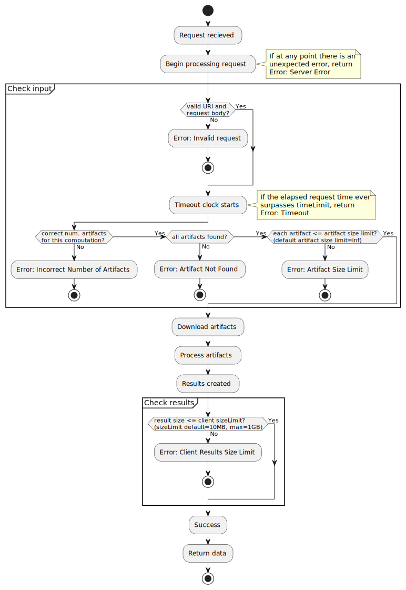
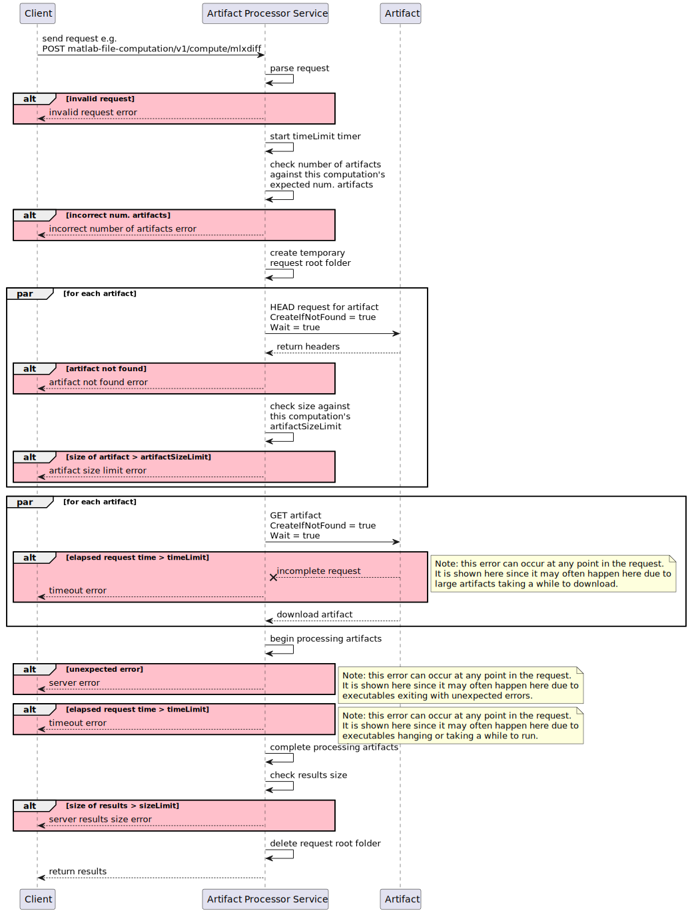

## Overview

The [Worker architecture](Worker-cookbook) provides a great way to compute long-running jobs using MATLAB or Go and store the results as artifacts to be referenced later.
However, for quicker computations, a simpler server that receives a request, runs a computation, and immediately returns the results as a response can save time and complexity.
This is the idea behind the _Artifact Processor service_.

## Table of Contents

- [Overview](#overview)
- [Table of Contents](#table-of-contents)
- [Client APIs](#client-apis)
    - [URI](#uri)
    - [URI Parameters](#uri-parameters)
    - [Request Body Schema](#request-body-schema)
    - [Success Responses](#success-responses)
    - [Example](#example)
- [Downloading Artifacts](#downloading-artifacts)
    - [Download Process](#download-process)
    - [Download Request Headers](#download-request-headers)
- [Error Conditions](#error-conditions)
    - [Table](#table)
    - [Error Flowchart](#error-flowchart)
    - [Error Sequence Diagram](#error-sequence-diagram)
- [Adding a New Computation](#adding-a-new-computation)
    - [Two Approaches Overview](#two-approaches-overview)
    - [1. How To Use the Base Image](#1-how-to-use-the-base-image)
        - [Pull the Base Image](#pull-the-base-image)
        - [Configuration Schema](#configuration-schema)
        - [Executable Interface](#executable-interface)
    - [2. How To Use The Library](#2-how-to-use-the-library)
        - [Import the Library](#import-the-library)
        - [Add a Route](#add-a-route)
        - [Implement the Handler](#implement-the-handler)
        - [Edge Cases to Be Aware Of](#edge-cases-to-be-aware-of)
            - [Context Canceled](#context-canceled)

## Client APIs

A client requests a computation with an HTTP `POST` request that specifies the type of computation requested and identifies the source artifacts to process.

### URI
```
POST :service/api/v1/compute/:action
```

### URI Parameters

| ID | Parameter Name | Required | Type (unit) | Default Value | Description |
| -- | -------------- | -------- | ----------- | ------------- | ----------- |
| U1 | :service       | Y        | string      | NA - required | The service name implies the server to send the request to. If the service exclusively computes results then it should have the suffix "-compute". For example, "matlab-file-compute". |
| U2 | :action | Y | string | NA - required | The type of computation to run on the artifacts passed. For example, "mlxdiff".

### Request Body Schema

```yaml
type: object
required:
    - mwtype
    - sourceArtifacts
properties:
    mwtype:
        description: |
            The message type.
            This parameter is required for Mito, but the value will always be
            `compute/request` for the current version of this service.
        type: string
    sourceArtifacts:
        description: |
            The artifacts to download and use as input for the computation.
            These inputs are either bundles identified by an artifact key or
            specific files identified with an artifact key and a list of file
            identifiers.
        type: array
        items:
            description: |
                An object identifying one source artifact.
                That source artifact may be a complete bundle or one or more
                files from a bundle depending on whether or not the "files"
                property was specified.
            type: object
            required:
                - key
            properties:
                key:
                    description: |
                        The artifact key associated with the bundle to process.
                    type: object
                    required:
                        - mrn
                        - artifactType
                    properties:
                        mrn:
                            description: |
                                The MRN associated with the bundle to process.
                            type: string
                        artifactType:
                            description: |
                                The type of artifact requested e.g. "directory".
                            type: string
                    additionalProperties: true
                files:
                    description: |
                        An array of files to download from the bundle.
                        If this field is not specified, the service will
                        download the whole bundle for processing.
                    type: array
                    items:
                        description: |
                            An object that identifies one or more files.
                            For now, this is only done with the "path" property
                            that specifies one file. Eventually, we may add
                            other properties to support more complex pattern
                            matching so clients can specify one or more files
                            e.g. all files with a given ending.
                        type: object
                        properties:
                            path:
                                description: |
                                    The filepath relative to the bundle root.
                                type: string
    sizeLimit:
        description: |
            The maximum payload size in bytes the server is allowed to return.
            If results are greater than this, the server will return an error
            containing the size of the full results. This limit is capped by a
            server-set maximum of 1 GB.
        type: integer
        minimum: 0
        maximum: 1000000000
        default: 10000000
    timeLimit:
        description: |
            The maximum time in milliseconds the server can take to respond.
            This counts the whole request's duration including the time it takes
            to parse the request, the time it takes to download artifacts, and
            the time it takes to process the artifacts. If the processing takes
            longer than this limit, then the server will return an error. This
            limit is capped by a server-set maximum of 3 minutes.
        type: integer
        minimum: 0
        maximum: 180000
        default: 3000
```

### Success Responses

The following table summarizes only those responses where the server encountered no errors or error conditions.
For more on error conditions, see the [Error Conditions](#error-conditions) section.

| ID | Description | Status Code | Status Code Description |
| -- | ----------- | ----------- | ----------------------- |
| R1 | The computation ran successfully. The results are contained in the response body and a new hash is included in the `ETag` header. | 200 | OK |
| R2 | The computation ran successfully and the value of the `If-None-Match` request header matched the value of the `ETag` response header. The response body is empty and the client may continue using its cached results. | 304 | Not Modified |

### Example
In this example, the client requests an MLX Diff computation on some files we know to be large, so we'll bump the limit up to 20MB, but we know it shouldn't take long so we'll bring the time limit down to 1s.
This is the first time the client is making this request, so it has no `If-None-Found` header value to send.

**Endpoint:**
```
POST matlab-file-compute/api/v1/compute/mlxdiff
```

**Request Body:**
```json
{
    "mwtype": "compute/message",
    "sourceArtifacts": [
        {
            "key": {
                "mrn": "mrn:project:v1:00aa00:00bb00:",
                "artifactType": "directory"
            },
            "files": [
                {
                    "path": "live_scripts/DigitsOfPiExample.mlx"
                }
            ]
        },
        {
            "key": {
                "mrn": "mrn:project:v1:11aa11:11bb11:",
                "artifactType": "directory"
            },
            "files": [
                {
                    "path": "live_scripts/DigitsOfPiExample.mlx"
                }
            ]
        }
    ],
    "sizeLimit": 20000000,
    "timeLimit": 1000
}
```


**Success Response:**

If the response is <= 20MB we'll get the data we requested
```
{
    ...computation-specific results...
    ...often JSON, but can be any data...
}
```
The response will also include an `ETag` header whose value is a hash of these results.

**Not Modified Response**

If the `If-None-Found` request header matches the hash of the successfully computed results, the response will have a 304 status code, no response body, and the unchanged value of the hash in the `ETag` header.
The server will send this response instead of an error if the results size is greater than the client size limit but the hash values match.

**Error Response:**

If the response is > 20MB we'll get some info including the size so we can show an error in the UI such as "Sorry, this result is too large at 23.1MB".
```json
{
    "error": "client result size limit",
    "completeSize": "23100100"
}
```
The `ETag` response header will not be included in error responses, since error responses will not contain results that would be useful for the client to cache.

## Downloading Artifacts

A critical step in this service's process is to gather inputs by downloading artifacts. The following sections includes details about how this critical step takes place.

### Download Process

Once the service has received a request, validated it, and confirmed that it specifies the right number of artifacts, the service begins checking each requested artifact one at a time.

For fast error checking, the service sends a preliminary `HEAD` request for each artifact in parallel.
The responses will include only header information, so they will be small even if the artifacts themselves are large.
From the response headers, the service can check that all artifacts requested were found and that the size of each is no more than the artifact size limit.

If those checks pass, the service sends a follow-up request, this time a full `GET` request to download each artifact.

Downloaded artifacts that need to be stored on disk will end up in the temporary _request root_ folder and will be filed into a _local bundle root_ folder based on the bundle they came from. More information about these temporary folders can be found in the [Executable Interface](#executable-interface) section.

### Download Request Headers

In both the `HEAD` and `GET` requests, the service includes the request headers `CreateIfNotFound=true` and `Wait=true`. This means that if the artifact requested does not yet exist, the service will wait for it to be created and returned.
Usually, if the artifact doesn't exist before this service requests it, the `HEAD` request will initiate the artifact's creation and it will still exist by the time the `GET` request is made, but it is good practice to include these headers in both requests to accommodate the rare case that the artifact gets deleted between the the two.

Beware of potential deadlocks, which could occur if this service is responsible for creating the requested artifact.
A good rule of thumb to prevent this deadlock is that this service should not be used to create artifacts.

The service will only wait for the artifact to be created as long as its timeout allows. Since the `timeLimit` applies to the entire duration of the request, the service will never wait for the artifact to be created for longer than the `timeLimit`. If this service does timeout, it will drop the request(s) for the artifact(s) and send an error back to the client. The error response will include some information about the stage at which the timeout occurred, in this case, while waiting for artifacts to be created.

## Error Conditions

### Table

The following table summarizes the possible errors that the client might receive as a response with a description of causes for each error.
This [MDN web docs page](https://developer.mozilla.org/en-US/docs/Web/HTTP/Status) was used for classifying error codes.

| ID | Stage | Error | Description | Status Code | Status Code Description |
| -- | ----- | ----- | ----------- | ----------- | ----------------------- |
| E1 | Check input | Invalid Request | The URI of the request is invalid (e.g. the computation type was not defined) or the body of the request is invalid. | 400 | Bad request |
| E2 | Check input | Incorrect Number of Artifacts | The length of the `sourceArtifacts` parameter does not match the expected number for the requested calculation. | 400 | Bad request |
| E3 | Check input | Artifact Not Found | For one or more of the artifacts requested, no matching artifact could be found. | 404 | Not found |
| E4 | Check input | Artifact Size Limit | The input artifacts requested are larger than the size limit set for this command. The error response will contain more information about the full size of the artifact. | 422 | Unprocessable content |
| E5 | Check results | Results Size Limit | The results were larger than the `sizeLimit` (passed value or default). The error response will contain more information about the full size of the results, so the client can optionally adjust the `sizeLimit` and retry. | 413 | Payload too large |
| E6 | General | Server Error | Something unexpected went wrong and the server cannot return a valid result. This includes an error in the executable while processing artifacts. The error response will contain more information about the stage at which this error occurred. | 500 | Internal server error |
| E7 | General | Timeout | The time to process this request was too long. The error response will contain more information about the stage at which this error occurred. | 408 | Request timeout |


### Error Flowchart

The following flowchart shows a simplified version of this service's process that highlights error conditions to help put the table above in context.


### Error Sequence Diagram

The following sequence diagram shows a simplified version of this service's process that highlights error conditions to help put the table above in context.


## Adding a New Computation

To provide extensibility and customization, the artifact processor service leaves the business logic of _how_ to process an artifact up to downstream developers.
This decouples the specific algorithms that process input artifact(s) from the reusable mechanics of receiving requests, downloading artifacts, etc. and has many benefits including:
1. Allowing for future use cases like processing file types that are not yet supported in Design Cloud
2. Reducing code duplication by reusing general components
3. Supporting specialty-based ownership by allowing downstream developers to focus on the processing algorithms suited to their expertise without having to bother with server mechanics

The following section describes how downstream developers can add their specific algorithm(s) to this service in the form of new computations.

### Two Approaches Overview

The Artifact Processor service supports two main ways for developers to add their own computation-specific logic.

1. As a compiled executable
2. As Go code

To give these two types of developers the simplicity or customization they want, this service offers two ways to add a new computation, respectively:

1. Use the Base Image - developers can pull a Base image with a pre-built server, configure it, and give it their executable. (This follows the model of the [Extension Server Base Image](https://github.mathworks.com/development/dc/wiki/Extension-Framework#extension-server-base-image)).
2. Use the Library - developers can import the Artifact Processor library to their Go project, implement their computation-specific handler, and build the full server with the `go-maven-plugin` or other tools.

### 1. How to Use the Base Image

#### Pull the Base Image

Developers of new computations can pull the Base image `artifact-processor-base-image`.
Using this image, developers should place the executable that runs their computation in the `/app/dc/artifact-processor/executable` folder of the container.
Then, they should place a `config.json` file in the `/app/dc/artifact-processor/config` folder of the container.
The `config.json` files should follow the [Configuration Schema](#configuration-schema) below.

For example, let's say we want to set up a service that can do computations for live script diffs and live script views.
The executables are called `compute-mlxdiff` and `create-mlxview` and are directly inside the `/app/dc/artifact-processor/executable` folder.
We want to diff any size files, but only create views for MLX files that are 1MB or smaller.
The `config.json` might look like this:

```json
[
    {
        "name": "mlxdiff",
        "executablePath": "compute-mlxdiff",
        "numArtifacts": 2,
    },
    {
        "name": "mlxview",
        "executablePath": "create-mlxview",
        "numArtifacts": 1,
        "artifactSizeLimit": 1000000
    }
]
```

Importantly, this configuration gives each computation a `name` which sets the URI value of `:action`.
The value of `:server` will come from an environment variable in the container.
Developers should add the following line to their Dockerfile to set the value of `:server`.

```Docker
ENV ARTIFACT_PROCCESSOR_SERVER_ROOT="/my-server"
```

Replacing `/my-server` with a logical name.

#### Configuration Schema

```yaml
type: array
minItems: 1
items:
    description: |
        An object representing the configuration for one executable.
    type: object
    required:
        - name
        - executablePath
        - numArtifacts
    properties:
        name:
            description: |
                The name that of this computation.
                This will be the value of `:action` in the URI.
            type: string
        executablePath:
            description: |
                The location of this computation's associated executable.
                This is specified as a file path relative to to
                `/app/dc/artifact-processor/executable`.
            type: string
        numArtifacts:
            description: |
                The number of input artifacts expected for this computation.
                For now, only this number of artifacts will be accepted and the
                server will return an error if any other number is specified.
                Eventually, we may add support for more than 10 artifacts or
                variable numbers of artifacts such as ranges or multiples.
            type: integer
            minimum: 0
            maximum: 10
        artifactSizeLimit:
            description: |
                The size limit of the input artifacts in bytes.
                If any input artifact is larger then this size then the server
                will return an error and stop processing. To set no limit or a
                limit of infinity, omit this property.
            type: integer
            minimum: 0
```

#### Executable Interface


**Input**

The executable will be called with N+1 arguments where N is the number of `SourceArtifact`s.
The first argument is exactly the `sourceArtifacts` parameter as JSON (in double quotes with all internal double quotes escaped).
This is followed by one argument for each `SourceArtifact` that will specify the file path of that `SourceArtifact` (also in double quotes).

Passing the `sourceArtifacts` JSON gives the `ArtifactType` and could help the executable map which files it needs to process.
Not all executables will need this argument.

The order of the N file path arguments will match the reading-order of `SourceArtifact`s specified by the client.
A `SourceArtifact` can be either a bundle specified by `MRN` and `ArtifactType` with no files specified or a single file specified by an object in the `files` parameter.

**Pre-execution Setup**

For each request, a temporary folder will be created to store all the data which will be referred to as the _request root_. 
For each bundle identified by a `key` value in the request, the base image creates a directory inside to _request root_ which will be referred to as the _local bundle root_.
The name of this directory will match the bundle ID.
The local bundle root will contain all of the files indicated by the `files` array, or, if `files` was omitted, it will contain all the contents of the bundle.
If a file object's `path` property contains a valid path through some directories, those directories will be created so the same path is valid relative to the local bundle root. (If the artifacts could not be downloaded or some other error took place, this will be handled in the base image code and the executable will never be called).

For example, imagine the `sourceArtifacts` parameter of some request has the following value.
```json
[
    {
        "key": {
            "mrn": "mrn:project:v1:77aa77:77bb77:",
            "artifactType": "directory"
        }
    },
    {
        "key": {
            "mrn": "mrn:project:v1:88aa88:88bb88:",
            "artifactType": "ArtifactType2"
        },
        "files": [
            {
                "path": "input.txt"
            },
            {
                "path": "img/image.png"
            }
        ]
    }
]
```

Assume the _request root_ is `123` and the bundle IDs associated with the two `key` objects are `abc` and `xyz` respectively.
The base image would create local bundle root directories `abc` and `xyz`, download the three `SourceArtifact`s (one bundle and two individual files), and call the executable with a command like the one shown below.
```
./compute-mlxdiff "[...]" "123/abc/" "123/xyz/input.txt" "123/xyz/img/image.png"
```
Note that the the JSON has been abbreviated to `[...]` for clarity, but in reality it would be the full value of `sourceArtifacts` as shown above but in one line and with escaped double quotes.


**Output**

The results of the executable should be two strings separated by a space in the form `<type> <value>` and printed to `stdout`.
The `<type>` string specifies how the data will be passed to the base image and can take three forms, each associated with a value type.

1. `string <complete string results>`
2. `file <filepath>`
3. `directory <filepath>`

The output will be read after the child process exits.
The `<value>` string should include a `\n` terminator, although this character will not be included in the results back to the client, since the results will be trimmed for leading and trailing whitespace including `\n`.

For example, a computation that results in some JSON might print:
```
string {"results":"123"}
```

The executable should have an exit code of zero to indicate no errors, or a nonzero integer to indicate an error.
If the server detects a nonzero exit code or improperly formatted results it will return a Server Error.

**Cleanup**

After the computation is complete, the base image will delete the temporary _request root_ folder (`123` in the example) to save space and reduce the risk of leaking the input artifacts to other requests.
Further security review will be needed to determine more strategies to eliminate the risk of leaking artifact data through attack vectors such as an input artifact being a malicious binary that reads privileged data.
Potential strategies include limiting the ports exposed by the docker container and limiting requests to one at a time so that no request could see another request's data.

### 2. How to Use The Library

#### Import the Library

Import the `artifact-processor` Go library with the `import` keyword.

#### Add a Route

[Mito](https://confluence.mathworks.com/display/OPSDK/Getting+Started) architecture allows for multi-stage routes which can be combined to achieve more complex data flows.
This works perfectly for the artifact processor service, since we can define a pattern of routes that will be used depending on the last section of the URL (i.e. `:action`).
For this service all routes will come in three parts:

1. Route Name - this should match `:action` exactly.
2. General Stage - this stage will do the initial and final checks on the request and will always be named `compute`.
3. Specific Stage - this is where the logic of the specific computation happens.
This stage should be named in the pattern `execute/:action`.

Therefore, the first step a developer will take to add a new computation should be registering a new route with the following code, replacing `:action` with the name of the new computation:

```go
_, err = registry.AddRoute(":action", "compute", "execute/:action")
```

For example:
```go
_, err = registry.AddRoute("mlxdiff", "compute", "execute/mlxdiff")
```

Go will compile the general code from the library along with the new code the developer has added, creating the two part route described.

#### Implement the Handler

The next step of development will be implementing the handler that processes the specific stage (second stage) of the route.
The code to do this will vary widely by computation type, but will have a function signature in the following pattern.

```go
func (h *Handler) Handle<:action>(ctx core.Context, msg compute.ComputeMessage) (io.ReadCloser, error)
```

For example:

```go
func (h *Handler) HandleMLXDiff(ctx core.Context, msg compute.ComputeMessage) (io.ReadCloser, error)
```

Returning an `io.ReadCloser` allows the service to efficiently stream the data back into the HTTP response writer before sending it back to the client.

#### Edge Cases to Be Aware Of

##### Context Canceled
The handler should be able to stop all processing in the event of a cancelled context at all times.
There are many resources for how to handle these sort of cancellations in Go.

If computation developers would like to pull some functionality that's defined in C/C++ into this service, they should almost always avoid CGO because the goroutine can block on a C call.
Instead, developers can create an executable from the C code which the Go can call as a child process and cancel if necessary.
The only case where developers can use CGO is if a reliable mechanism is in place within the C code to immediately handle cancellation signals that could come from Go.
